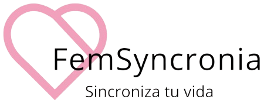
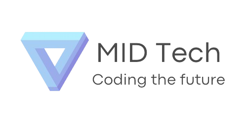
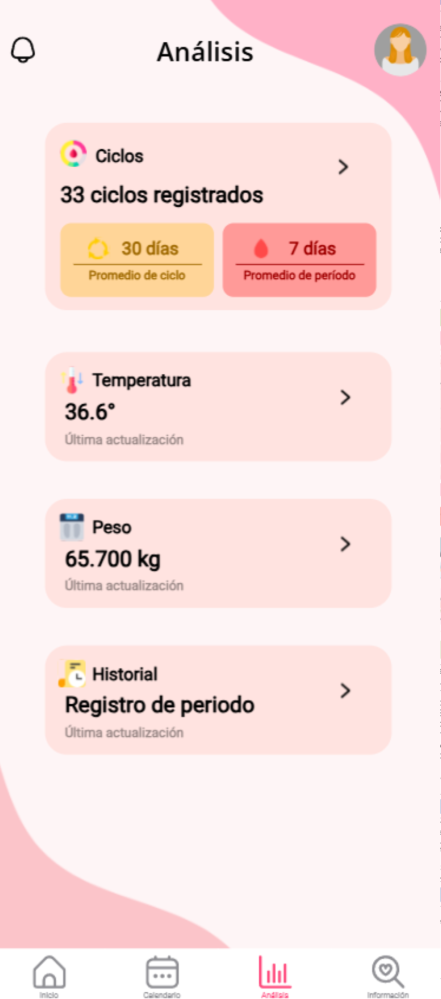
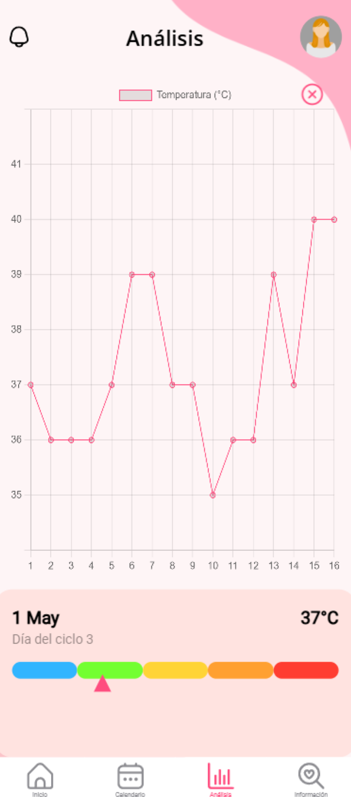

<p align="left">
  
</p>

> FemSyncronia es una aplicación móvil impulsada por inteligencia artificial, diseñada para acompañar a las mujeres en el seguimiento de su ciclo menstrual. 

## 👥 ¿Quiénes somos?
<table>
<tr>
  <td width="190">
    
  </td>
  <td>
    Somos <strong>MID Tech</strong>, un grupo de estudiantes de Ingeniería en Computación del <strong>Centro Universitario de Ciencias Exactas e Ingenierías (CUCEI)</strong> de la <strong>Universidad de Guadalajara</strong>.
  </td>
</tr>
</table>


## 🎯 Propósito y objetivo

**💡 Nuestro propósito:**  
Desarrollar y mejorar una aplicación móvil tipo calendario menstrual, implementando Inteligencia Artificial para ofrecer predicciones más precisas y funciones innovadoras.

**🚀 Nuestro objetivo:**  
Ayudar a las mujeres a llevar un mejor control de su ciclo menstrual y disfrutar sus días con mayor tranquilidad.
<br>

## 📱 ¿Qué hace nuestra app?

📅 Ofrece predicciones precisas sobre el periodo, los días fértiles y los síntomas asociados, adaptándose al cuerpo de cada usuaria.   
🔄 Gracias al registro constante, la IA 🤖 implementada **aprende y mejora con el tiempo**, brindando  🎯 **recomendaciones cada vez más personalizadas y confiables**.

<br>

## 🧩 Funcionalidades

- 🔁 Seguimiento continuo del ciclo menstrual.
- 📅 Predicción de días fértiles y próximos periodos.
- 🧠 Predicción de síntomas usando IA (regresión lineal múltiple).
- 📊 Gráficas y estadísticas personalizadas.
- 🎯 Recomendaciones inteligentes adaptadas al perfil de la usuaria.
- 🌸 Registro de síntomas con interfaz clara y accesible.


## 🛠️ Tecnologías utilizadas


## 🖼️ Preview
>Una mirada rápida al funcionamiento de la app:

<p align="left">
  
  
  
  
  
  
</p>


## 🏛️ Propiedad intelectual

<p align="center">
  
</p>

Todos los derechos de esta aplicación, incluyendo su diseño, logo, funciones y contenido, pertenecen a <strong>MID Tech</strong> en colaboración con el <strong>Centro Universitario de Ciencias Exactas e Ingenierías (CUCEI)</strong> de la <strong>Universidad de Guadalajara</strong>.

Este proyecto fue desarrollado con fines académicos como parte del <strong>proceso de titulación</strong> de la carrera de <em>Ingeniería en Computación</em>.  
Su distribución o uso con fines comerciales está sujeta a revisión y autorización por los autores.
<br>
<br>


## 🎓 Proyecto académico
**FemSyncronia** forma parte de nuestro <strong>proyecto modular de titulación</strong>, donde aplicamos los conocimientos adquiridos a lo largo de nuestra formación académica en desarrollo de software, inteligencia artificial y diseño de interfaces.

---

<p align="center">
  <em><strong style="font-size: 20px;">✨ Nuestro compromiso es contigo ✨</strong></em><br>
  <em>Seguiremos mejorando e innovando continuamente esta app para ofrecerte la mejor herramienta<br>
  y que cada ciclo sea más fácil de llevar ❤️</em>
</p>


<!--
## 🚀 Instalación rápida

```bash
# Clona el repo
git clone https://github.com/mallyhernandez/FemSyncronia.git

# Entra al proyecto
cd FemSyncronia

# Instala dependencias
npm install

# Corre el servidor
ionic serve
-->